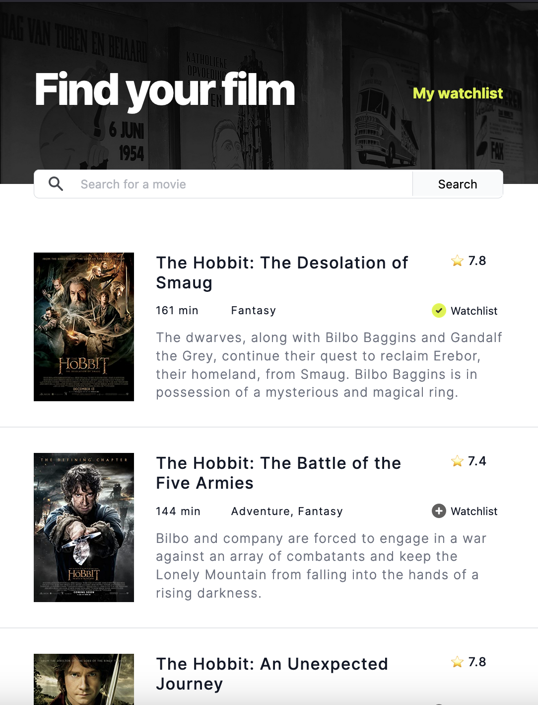
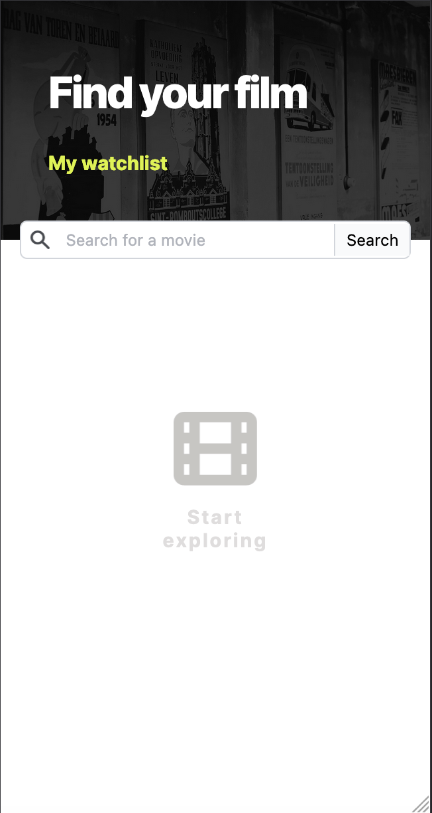
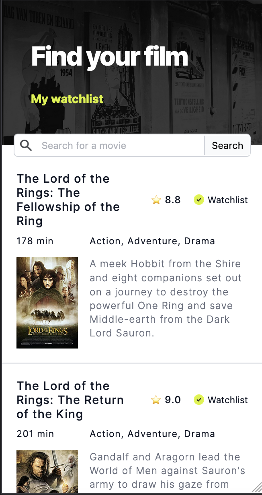
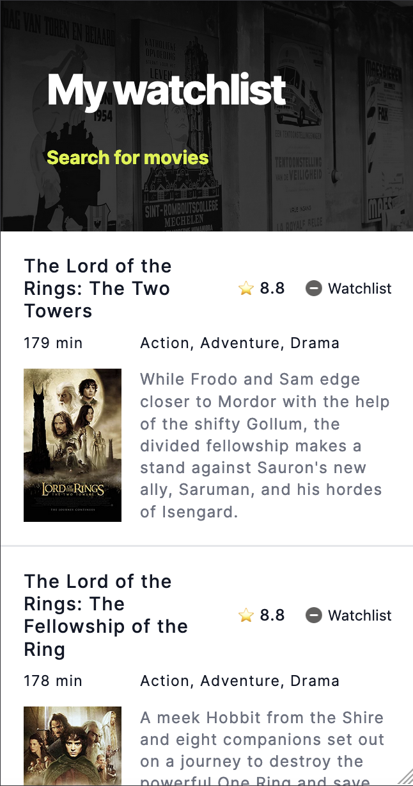

# Movie Watchlist 🎬

#### ✨ Deployed/demo version 

## Demo overview
This project consists of two pages: a Homepage and a Watchlist Page. 

Possible actions:
- Inputting a movie title into the search bar and then clicking the 'Search' button
- Once movie options are displayed, the user can add a movie their watchlist by clicking on the '+' button on the screen
- Clicking on 'My Watchlist' allows the user to access their curated movie watchlist
- If the user wishes to remove a movie from this watchlist, the user can do so by clicking on the '-' button on the screen

## Developer overview
- The majority of the app was built with JavaScript
- The app uses the user input from the search bar to inform the API call 
- The API returns data relative to the movie title searched for
- That data is used to create the HTML and display the movie options on screen
- Once the user clicks to add a movie to their watchlist, that information is converted into strings and saved in localStorage
- All the saved movie titles can be accessed on the 'My Watchlist' page by parsing the data saved in localStorage
- If a user chooses to remove a title from their watchlist, localStorage is updated to remove that movie

 

 

   

## API
- 

## Author: 
👩‍💻 Rebecca Louw 

## Built with:

  
 
  
